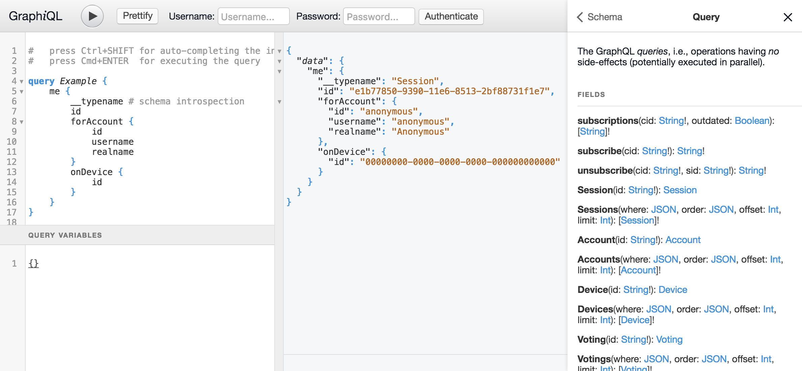

hapi-plugin-graphiql
====================

[HAPI](http://hapijs.com/) plugin for [GraphiQL](https://github.com/graphql/graphiql) integration

<p/>


<p/>




Installation
------------

```shell
$ npm install hapi hapi-plugin-graphiql
```

About
-----

This is a small plugin for the [HAPI](http://hapijs.com/)
server framework for seamless integration of
[GraphiQL](https://github.com/graphql/graphiql), an interactive
[GraphQL](http://graphql.org/) user interface. This variant of GraphiQL
especially integrates a username/password based login dialog and reports
network responses in the GraphiQL status bar. In case of its
downstream/local copy of GraphiQL, it also applies some [additional
changes to GraphiQL's internals](local/).

Usage
-----

The following example shows the plugin in action.
The shown options are actually the default ones:

```js
server.register({
    register: require("hapi-plugin-graphiql"),
    options: {
        graphiqlSource: "downstream",
        graphiqlGlobals: "",
        graphiqlURL: "/api",
        graphqlFetchURL: "/api/data/graph",
        graphqlFetchOpts: `{
            method: "POST",
            headers: {
                "Content-Type": "application/json",
                "Accept":       "application/json"
            },
            body: JSON.stringify(graphQLParams),
            credentials: "same-origin"
        }`,
        loginFetchURL: "/api/auth/login",
        loginFetchOpts: `{
            method: "POST",
            headers: {
                "Content-Type": "application/json"
            },
            body: JSON.stringify({
                username: username,
                password: password
            }),
            credentials: "same-origin"
        }`,
        loginFetchSuccess: "",
        loginFetchError: "",
        graphqlExample:
            "query Example {\n" +
            "    Session {\n" +
            "        __typename # schema introspection\n" +
            "    }\n" +
            "}\n",
        documentationURL:  "",
        documentationFile: ""
    }
})
```

This assumes you have a REST-based authentication endpoint
`/api/auth/login` and a GraphQL endpoint `/api/data/graphql`. The
GraphiQL UI then can be accessed under `/api`. The authentication
endpoint is assumed to accept `{ username: "...", password: "..." }` and
sets the authentication token as a HTTP cookie for `/api`. If you your
authentication endpoint returns `{ token: "..." }` and the token has to be passed in an
`Authorization` header as a Bearer token, use the following configuration instead:

```js
server.register({
    register: require("hapi-plugin-graphiql"),
    options: {
        graphiqlSource: "downstream",
        graphiqlGlobals: `var token = null;`,
        graphiqlURL: "/api",
        graphqlFetchURL: "/api/data/graph",
        graphqlFetchOpts: `{
            method: "POST",
            headers: Object.assign({
                "Content-Type":  "application/json",
                "Accept":        "application/json"
            }, token ? {
                "Authorization": "Bearer " + token
            } : {}),
            body: JSON.stringify(graphQLParams),
            credentials: "same-origin"
        }`,
        loginFetchURL: "/api/auth/login",
        loginFetchOpts: `{
            method: "POST",
            headers: {
                "Content-Type": "application/json"
            },
            body: JSON.stringify({
                username: username,
                password: password
            }),
            credentials: "same-origin"
        }`,
        loginFetchSuccess: `token = JSON.parse(response.text()).token;`,
        loginFetchError:   `token = null;`,
        graphqlExample:
            "query Example {\n" +
            "    Session {\n" +
            "        __typename # schema introspection\n" +
            "    }\n" +
            "}\n"
    }
})
```

Options
-------

The supported configuration options are:

- `graphiqlSource`:<br/>
  The source for GraphiQL, either `upstream` (original vendor version) or
  `downstream` ([patched local version](local/)).
  Default: `"downstream"`

- `graphiqlGlobals`:<br/>
  JavaScript code snippet injected into the global scope of the GraphiQL integration.
  Usually used for injecting a global variable for use in the other code snippets.
  Default: `""`

- `graphiqlURL`:<br/>
  The URL under which the GraphiQL UI is registered for `GET` requests.
  This can be even the same as the GraphQL URL, as it is usually registered for `POST` requests.
  Default: `"/api"`

- `graphqlFetchURL`:<br/>
  The URL under which the GraphQL API can be reached via `POST` requests.
  Default: `"/api/data/graph"`

- `graphqlFetchOpts`:<br/>
  JavaScript code snippet injected into the W3C-Fetch API call as options
  for fetching a GraphQL query.
  Default:

    ```
    `{
        method: "POST",
        headers: {
            "Content-Type": "application/json",
            "Accept":       "application/json"
        },
        body: JSON.stringify(graphQLParams),
        credentials: "same-origin"
    }`
    ```

- `loginFetchURL`:<br/>
  JavaScript code snippet injected into the W3C-Fetch API call as options
  for logging in.
  Default: `"/api/auth/login"`

- `loginFetchOpts`:<br/>
  JavaScript code snippet injected into the W3C-Fetch API call as options
  for logging in.
  Default:

    ```
    `{
        method: "POST",
        headers: {
            "Content-Type": "application/json"
        },
        body: JSON.stringify({
            username: username,
            password: password
        }),
        credentials: "same-origin"
    }`
    ```

- `loginFetchSuccess`:<br/>
  JavaScript code snippet injected into the success handler of the W3C-Fetch API call
  for loggin in.
  Default: `""`

- `loginFetchError`:<br/>
  JavaScript code snippet injected into the error handler of the W3C-Fetch API call
  for loggin in.
  Default: `""`

- `graphqlExample`:<br/>
  A GraphQL query string used as the initial query source in the UI.
  Default:

    ```
    "query Example {\n" +
    "    Session {\n" +
    "        __typename # schema introspection\n" +
    "    }\n" +
    "}\n"
    ```

- `documentationURL`:<br/>
   URL (usually under `graphiqlURL`) under which you want
   to reference a single documentation file with the markdown
   directive `[name](url)` from within your GraphQL schema comments.

- `documentationFile`:<br/>
  The local path to the file to serve if `documentationURL` is requested.

License
-------

Copyright (c) 2016-2018 Ralf S. Engelschall (http://engelschall.com/)

Permission is hereby granted, free of charge, to any person obtaining
a copy of this software and associated documentation files (the
"Software"), to deal in the Software without restriction, including
without limitation the rights to use, copy, modify, merge, publish,
distribute, sublicense, and/or sell copies of the Software, and to
permit persons to whom the Software is furnished to do so, subject to
the following conditions:

The above copyright notice and this permission notice shall be included
in all copies or substantial portions of the Software.

THE SOFTWARE IS PROVIDED "AS IS", WITHOUT WARRANTY OF ANY KIND,
EXPRESS OR IMPLIED, INCLUDING BUT NOT LIMITED TO THE WARRANTIES OF
MERCHANTABILITY, FITNESS FOR A PARTICULAR PURPOSE AND NONINFRINGEMENT.
IN NO EVENT SHALL THE AUTHORS OR COPYRIGHT HOLDERS BE LIABLE FOR ANY
CLAIM, DAMAGES OR OTHER LIABILITY, WHETHER IN AN ACTION OF CONTRACT,
TORT OR OTHERWISE, ARISING FROM, OUT OF OR IN CONNECTION WITH THE
SOFTWARE OR THE USE OR OTHER DEALINGS IN THE SOFTWARE.

